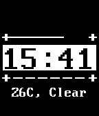

# simplecforpebble
This is the initial README for the simplecforpebble git repo. This is following the [Pebble](https://developer.pebble.com/) tutorial [Build Your Own Watchface in C](https://developer.pebble.com/tutorials/watchface-tutorial/part1/).

